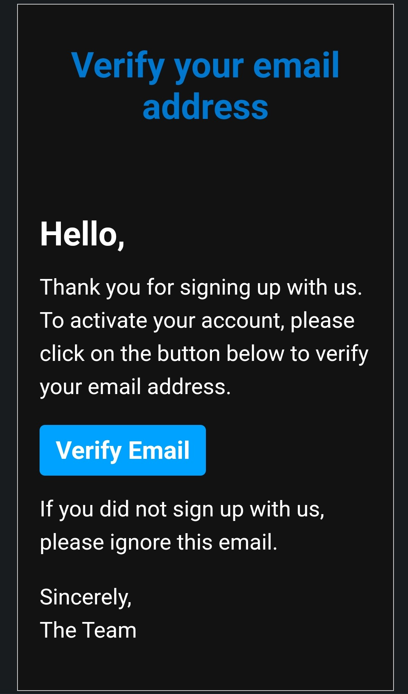

## SMPT server in golang that sends multiple emails to users using html css
### you will need to email and app-password

### first the program will load environment variables from ".env" file

```go
func getEnvs() {
	file, err := os.Open(".env")

	if err != nil {
		log.Fatal(err)
	}

	defer file.Close()

	scanner := bufio.NewScanner(file)

	for scanner.Scan() {
		line := scanner.Text()
		parts := strings.SplitN(line, "=", 2)

		if len(parts) == 2 {
			key := parts[0]
			value := parts[1][1 : len(parts[1])-1]
			os.Setenv(key, value)
			fmt.Println(key, "=", value)
		}
	}

	if err := scanner.Err(); err != nil {
		log.Fatal(err)
	}
}
```
### using `bufio.NewScanner(file)` to scan the file line by line
### then split every line by "=" one time `strings.SplitN(line, "=", 2)`
### then remove quotes in begging and end of the value `value := parts[1][1 : len(parts[1])-1]`
### then set environment variable using `os.Setenv(key, value)`


## send emails function


```go
func sendMail(emails *[]string, html *[]byte, subject string) {
	from := os.Getenv("FROM")

	header := make(map[string]string)
	header["From"] = from
	header["To"] = (*emails)[0]
	header["Subject"] = subject
	header["MIME-Version"] = "1.0"
	header["Content-Type"] = `text/html; charset="UTF-8"`

	message := ""

	for k, v := range header {
		message += fmt.Sprintf("%s: %s\r\n", k, v)
	}

	message += "\r\n" + string(*html)

	auth := smtp.PlainAuth("", from, os.Getenv("APP_PASSWORD"), "smtp.gmail.com")
	err := smtp.SendMail("smtp.gmail.com:587", auth, from, *emails, []byte(message))

	if err != nil {
		fmt.Println(err)
		os.Exit(1)
	}

	fmt.Println("Successfully sent mail")
}
```

### make headers using map
### then set header and html content in one byte array
### authenticate using email and app-password `smtp.PlainAuth("", from, os.Getenv("APP_PASSWORD"), "smtp.gmail.com")`
### send email to all users emails in list of emails `smtp.SendMail("smtp.gmail.com:587", auth, from, *emails, []byte(message))`


## call main function

```go
func main() {
	getEnvs()
	body, err := os.ReadFile("email.html")

	if err != nil {
		fmt.Println(err)
		os.Exit(1)
	}

	emails := []string{"hstivggfghyhgfg@gmail.com"}

	sendMail(&emails, &body, "Verify Your Email")
}
```
## demo


